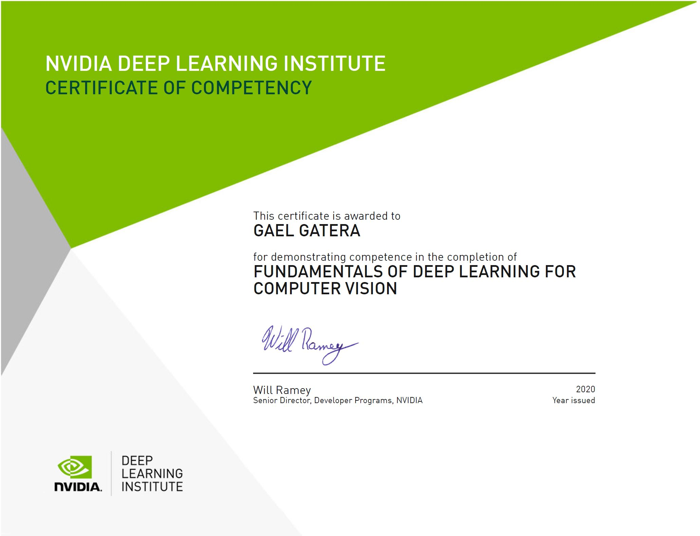

# NVIDIA-DLI-Fundamentals-of-Deep-Learning-for-Computer-Vision
Recently got certified from NVIDIA's Deep Learning Institute all credit to NSBE Energy SIG's recent partnership with NVIDIA.
I highly recommend this course to either newbies or experience in the field of computer as it is always a good idea to go back to basics and reason from first principles.
All rights reserved provided by NVIDIA for the course.

Will provide quick summaries and feedback of my experience of all the sections in indipendent markdown files so that others may be enticed to also take the certification.

### Section 1 - Training Deep Neural Networks
### Section 2 - Deploying Training Neural Networks
### Section 3 - Performance analysis

