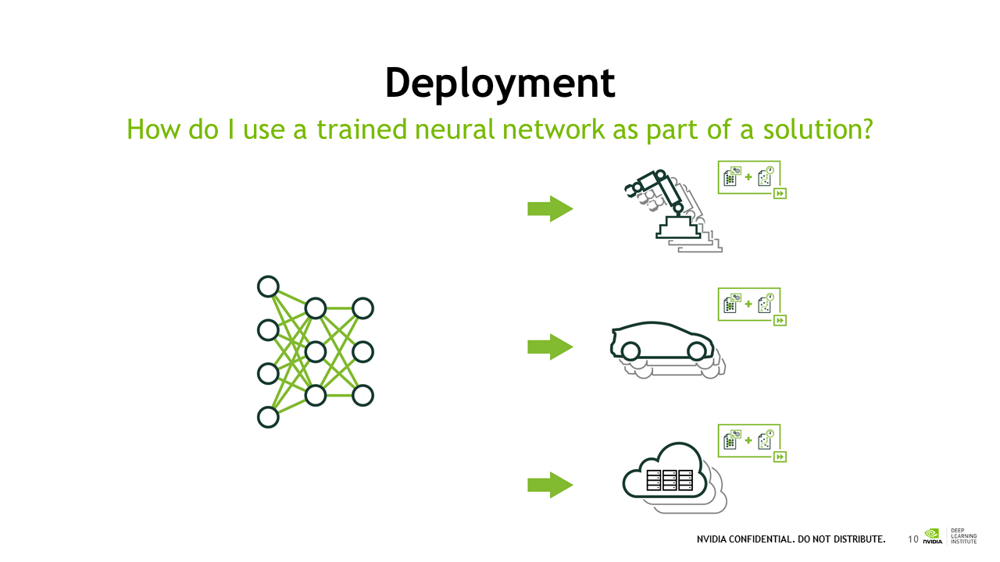

# Deploying our Model: GPU Task 3

Continuing with the theme of using animals to teach applications of computer vision, the next task involves deploying a train neural network to create a simulated doggy door that only opens to dogs.
Here is the full scenario:

"Louie wants to be able to enter and exit his house without requiring a person to let him in. His roommate, a cat named Nala, hunts, and therefore sometimes brings her catch with her. Nala needs to be checked at the door. The solution: We just trained a neural network model to classify dogs from cats. In this next section, you'll deploy that trained model into a simulator."



As explained, there are two distinct portions of the deep learning workflow:

1. **Training**: The input that our network expects is determined both by its architecture and by how it was trained.

2. **Deployment**: Deployment requires writing code to convert the input we have to the input the network expects. The output that our network generates is determined by its architecture and what it learned. Deployment also requires writing code to convert the output that is generated to the output our end user expects. 

DIGITS places the files we need to deploy in a directory that can either be downloaded or just pointed to. 
The models in this example are made using the caffee framework and deployed on the same server as it was trained, the user 
just points to the folder path that DIGITS generates.

This module explaines that a "model" consists of two files: the architecture and the weights.

Futhermore it introduced the different processing steps of the training and deployment workflow.

1. Creating an Expected Input: Preprocessing
In this case the pre processing of the images were in two steps using open cv
a. resized the image to 256x256 color images
sample code:

```python
import cv2
input_image=cv2.resize(input_image, (256, 256), 0,0)
plt.imshow(input_image)
plt.show()
```

b. ormalized the images by subtracting the mean image from each image to reduce the computation necessary to train.
sample code:

```python
mean_image = caffe.io.load_image(DATA_JOB_DIR+'/mean.jpg')
ready_image = input_image-mean_image
```

2. Forward Propagation: Using your model

3. Generating a useful output: Postprocessing

4. Deployment

My edited version of the given deployment.py
