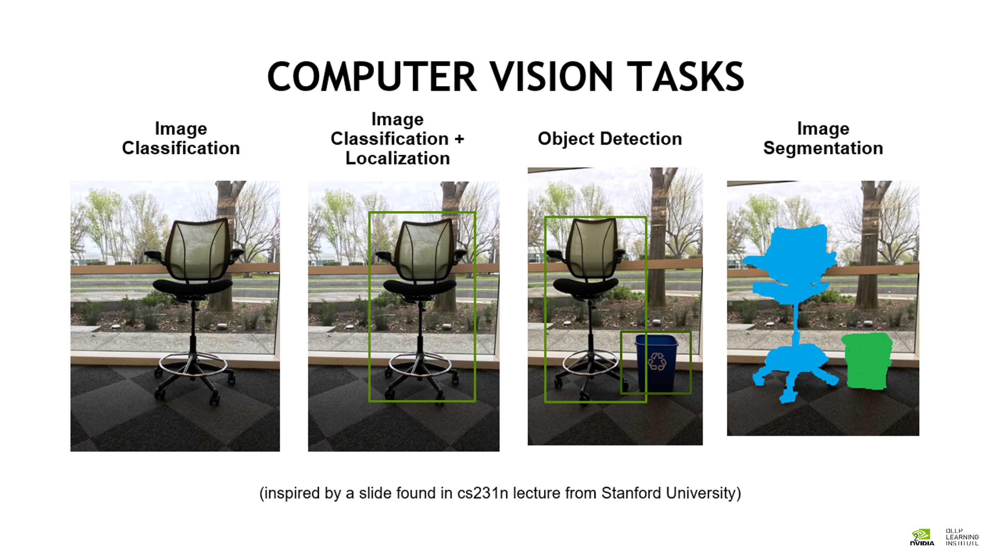
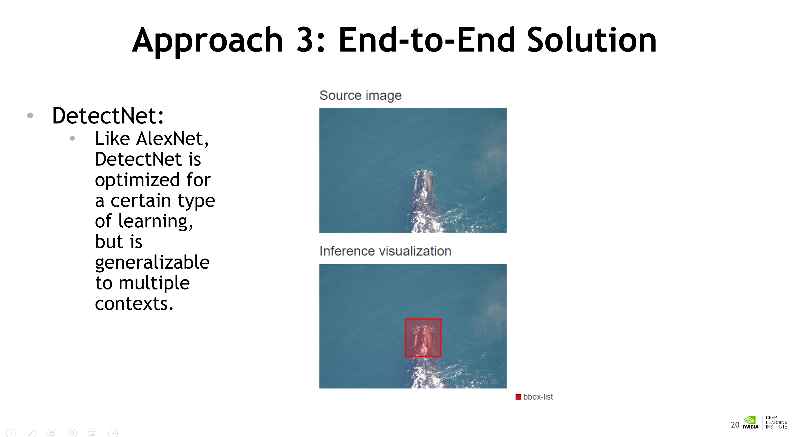

# Performance during Training: GPU Task 4

This section explains to students that training is measured by how accurately a model aligns with the real world.
The section introduces the following quantities: training loss, validation loss, and accuracy. Ideally, the values of training and validation loss should decrease from epoch to epoch, although they may jump around some. 

The following points are made using pre trained models to teach the concepts:
* To run more training epochs on an existing model, analogous to a human learner studying more.
* To search the hyperparameter space, analogous to a human learner responding differently to a different teaching style.
* To use the results of others' research, compute, network design, and data, analogous to a human learner copying off an expert

Futhermore, that four aspects of the Neural Nets can manipulate to improve performance. 

**1) Data** - A large and diverse enough dataset to represent the environment where our model should work. Data curation is an art form in itself.

**2) Hyperparameters** - Making changes to options like learning rate are like changing your training "style." Currently, finding the right hyperparameters is a manual process learned through experimentation. As you build intuition about what types of jobs respond well to what hyperparameters, your performance will increase.

**3) Training time** - More epochs improve performance to a point. At some point, too much training will result in overfitting (humans are guilty of this too), so this can not be the only intervention you apply.

**4) Network architecture** - We'll begin to experiment with network architecture in the next section. This is listed as the last intervention to push back against a false myth that to engage in solving problems with deep learning, people need mastery of network architecture. This field is fascinating and powerful, and improving your skills is a study in math.

# Object Detection: GPU Task 5

This section of the course introduce the most commonly used input/output pairings in computer vision problems and labels their corresponding workflows.
Summed up in the table below:

| Workflow             | Input                                                 | Output                                                                                                                             |
|----------------------|-------------------------------------------------------|------------------------------------------------------------------------------------------------------------------------------------|
| Image Classification | Raw Pixel Values                                      | A vector where each index corresponds with the likelihood or the image of belonging to each class                                  |
| Object Detection     | Raw Pixel Values                                      | A vector with (X,Y) pairings for the top-left and bottom-right corner of each object present in the image                          |
| Image Segmentation   | Raw Pixel Values                                      | A overlay of the image for each class being segmentation, where each value is the likelihood of that pixel belonging to each class |
| Text Generation      | A unique vector for each 'token' (word, letter, etc.) | A vector representing the most likely next 'taken'                                                                                 |
| Image Rendering      | Raw Pixel Values of a grainy Image                    | Raw pixel values of a clean image                                                                                                  |

Visualized below:

In order to add functionality and map the given inputs to desired outputs this course gives three different approached:

## Approach 1 - Combining DL with programming
* Scaling models programmatically to create new functionality using the sliding windown approach.

** Advantages **
In a dog/ 'not dog' classifier, the sliding window with non-overlapping grid squares means that it is very likely that some of our grid squares will only partially contain a dog and this can lead to misclassifications. However, as we increase the overlap in the grid squares we will rapidly increase the computation time for this sliding window approach. We can make up for this increase in computation by batching inputs, a strategy that takes advantage of the GPU's intrinsic strength of parallel processing.

** Disadvantages **
Needs Human supervision, slow - constrained by image size.

## Approach 2 - Experiment with network architecture
* Study the math of neural networks to create new functionality

Quoting directly from slide: "Since layers a mathematical operations on tensors (Matrics, Vectors, etc.) Layers are combined to describe the architecture of a neural network modifications to network architecture of a neural network modifications to network architecture impact capability and performance. Each Frameowkr has different syntax for describing architectures. Regardless of framework: The output of each layer must fit the input of the next layer."

At this point the AlexNet gets turned into a "Fully Convolutional Network" and continue to introduce Convolution Neural Network Architectures.

## Approach 3 - Identify similar solutions
* Study existing solutions to implement new functionality

In this approach, the course teaches students to find existing research that is similar to the problem statement they are trying to solve and tweak as much as possible depending on the desired output. Fo instance they introduce another famous Neural Network called **DetectNet** which is more fitting for object detection than the first explored network **AlexNet**. 

