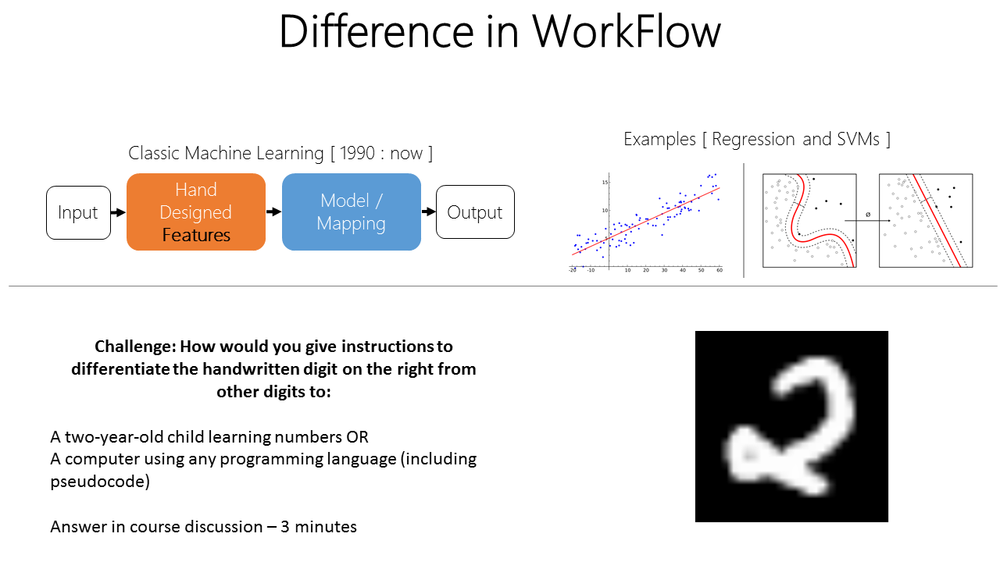
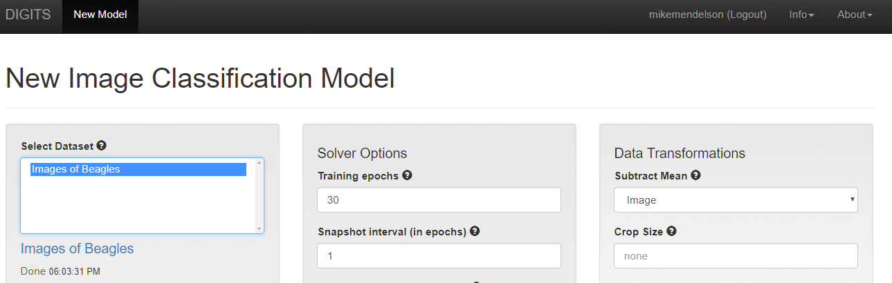

# Biological Inspiration
Explained the limitations of step-by-step computer instructions, algorithms. 
This constraint limited computer scientists to only be able to solve:
1. Problems they understood clearly
2. Can describe the solution with step-by-step instructions that a computer can understand.

The course then challenges students to classifiy a handwritten "2"
1. Using pseudo-code
2. To a 2 year old just learning about numbers



My answers here:
#### Pseudo Code

All numbers until infinity have a specific score repesented by a tuple depending on the amount of color channels.
In other words, any arbitray number that is represented by an RGB image is meant to have (n score red in red channel, n score in green channel, n score in blue channel).
This example makes things a bit easier for us in the sense that it is a binary image.
So we have 2 dimensions where row, column combination is wither 0 (black) or 1 (white).

```stdin
black_pixels_score = 0
white_pixels_score = 0

for row_p in height_image:
   for column_p in width_image:
      if (row_p, colmn_p) == 0:
         black_pixels_score += 1
      else:
         white_pixels_score += 1

real_2 = (67, 83)

fake_2 = (black_pixels_score, white_pixels_score)

if fake_2 == real_2:
   correct_classification
else:
   false_classification

```

#### Explanation to two year old kids

```stdin
All twos have two loops. 
A loop on top that looks like a hook and a half circle and a loop at the bottom that has a tail
```

# Deep Neural Networks: GPU Task 1

The purpose of this task is to introduce the student to the [DIGITS](https://developer.nvidia.com/digits) environment that does not require knowledge of code while introducing concepts of image classification.
The environment is loaded and task is started with a play buttom that takes to a jupyter notebook with more instructions.




1. Student chooses a dataset of Images of Beagles contains 8 labeled images of Louie and 8 labeled images of other dogs.

2. Next, student chooses AlexNet is architected after the human visual cortex and has won the largest image recognition challenge in the world, ImageNet. Access to high-performing networks like AlexNet remove the requirement that every deep learning practitioner understands the structure of the brain and instead can focus on training.

3. Student runs the model with only one epoch proceeding to making a single predictions resulting in a probability of Louie being accurately 50.29% predicted while not Louie being predicted 49.71%.

4. Student increases the number of epochs to 100 then the accuracy of that same image correctly predicting Louie increasing to 100 %.

# Big Data: GPU Task 2

Purpose of this section to to explain that in machine learning, experience comes in the form of data. The task in this section applies a large dataset to the classification problem to create a model that works on new data, a requirement that reduces overfitting. Essentially training the neural network as a teacher would a student to learn higher-level concepts vs. memorizing examples. 


